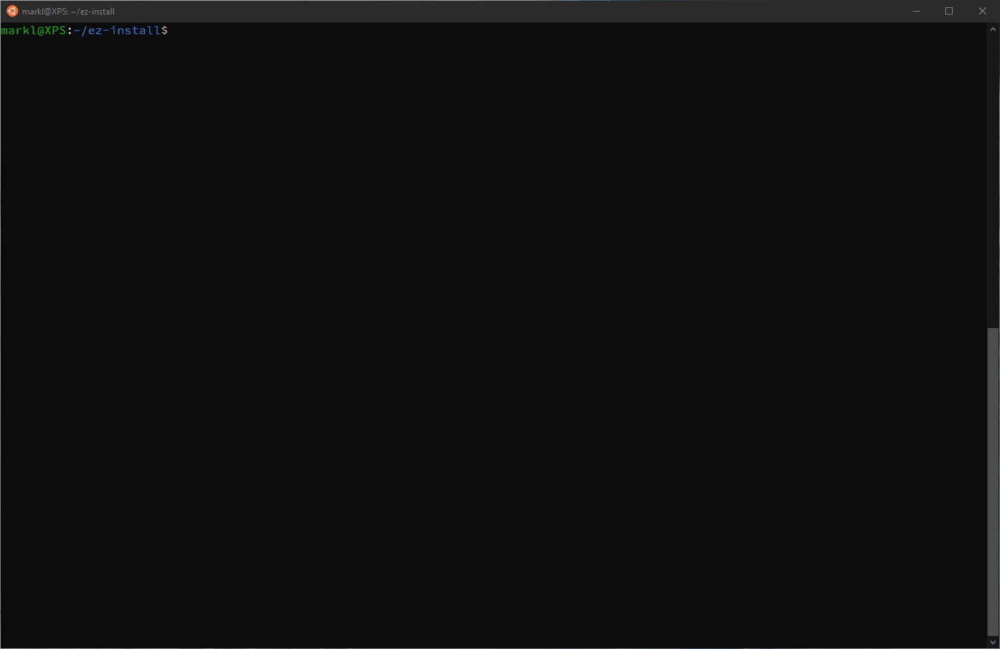

# ez-install

ez-install intends to alleviate the pain of installing UNIX binaries, packages,
git repositories, personal configurations, environment setup, etc.



## Installation

Firstly, clone the repo.

```sh
git clone --depth=1 https://github.com/marklcrns/ez-install ~/.ez-install
```

Then, create a soft symlink of the `ez` into `${INSTALL_DIR}`, preferably one
included in `$PATH` e.g., `/usr/local/bin`.

```sh
mkdir -p ${INSTALL_DIR}
ln -s ~/.ez/ez ${INSTALL_DIR}

# or simply run from root dir (will install in /usr/local/bin/)

make
```

Finally, `export EZ_INSTALL_HOME` in your `~/.bashrc` or `~/.zshrc` or in any
environment rc file of your shell initialized on startup.

```sh
export EZ_INSTALL_HOME='~/.ez-install'
```

## Usage

```sh
ez [ flags ] [ package(s) ]

# from cmdline arguments
ez build-essential git-lfs nvim

# from a file
ez "$(cat packages.txt)"
```

## Config

All custom packages, by default, are located in `~/.ez-install.d` and local rc
file in `~/.ez-installrc`

## TODO

- [ ] Integrate with [Dotfiles Manager](https://github.com/marklcrns/scripts/blob/master/tools/dotfiles/README.md)
- [ ] More practical package installer template generator
  - [X] Modularize script
  - [X] Option to generate package dependency
  - [ ] Interactive package installer generator
  - [ ] Generate package installer from command history
- [ ] Handle package dependencies
  - [X] Dependency system
  - [X] Print dependency tree before installation
  - [X] Prevent package installation with missing dependencies
  - [X] Full support for custom package install directory
- [X] More flexible installation
  - [X] Support individual installation via commandline
  - [X] Support JSON install configuration
- [ ] Add more features
  - [ ] Cache all installed packages
  - [ ] Uninstall script
  - [ ] Package update script
    - [ ] Package version watcher
- [ ] OS support
  - [x] Debian/Ubuntu
    - [x] 20.04
    - [x] 18.04
  - [x] Debian/Ubuntu (WSL/WSL2)
    - [x] 20.04
    - [x] 18.04
  - [ ] More OS support coming
- [ ] Package managers support
  - [X] apt
  - [X] apt-add
  - [X] pkg
  - [X] npm
  - [X] pip
  - [X] git
  - [X] curl
  - [X] wget
  - [X] local
  - [ ] More support coming
- [ ] Bourne Shell support

