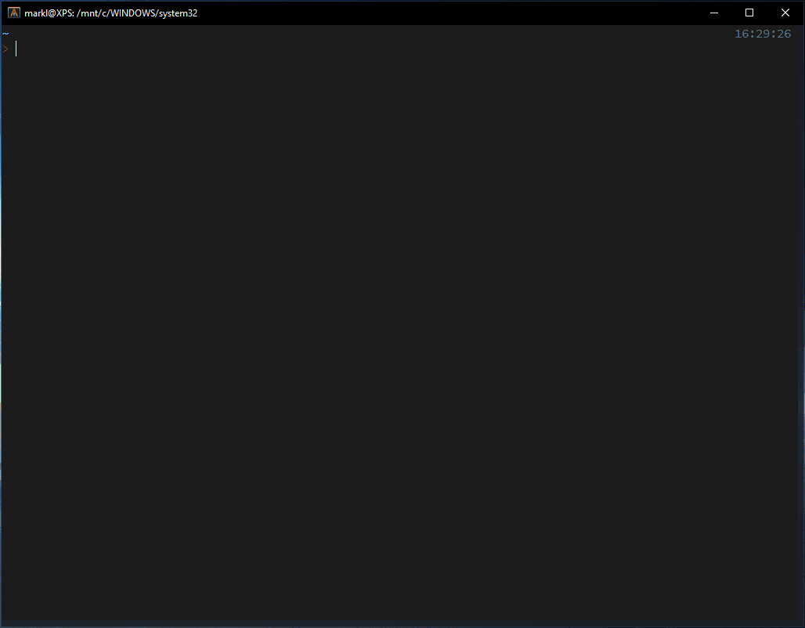

# Ez-install

Install your packages and its dependencies, personal dotfiles, run scripts, pull
repositories, and more in just one command.

Ez-install has a `make`-like system that tries to install dependencies first
before the main target package. Dependency failure will halt the target package
installation.

With the [package generation](#package-generator) system, you can create your
own package installer from many different package managers with little to no
Bash scripting knowledge.

Finally, installing packages using the [built-in install
functions](#built-in-install-functions) are subject for the convenient package
reporting after the installation.

<!-- TOC GFM -->

* [Installation](#installation)
* [Usage](#usage)
  * [In-line Options](#in-line-options)
  * [Reporting](#reporting)
* [Config](#config)
* [Pre and Post Installation](#pre-and-post-installation)
* [Package Generator](#package-generator)
  * [Simple Package Generator Usage](#simple-package-generator-usage)
  * [Advanced Package Generator Usage](#advanced-package-generator-usage)
  * [Sample Package Geneartor Usage For `git`, `curl`, and `wget`](#sample-package-geneartor-usage-for-git-curl-and-wget)
  * [More Advanced Package Generator Usage](#more-advanced-package-generator-usage)
  * [Interactive Package Generator](#interactive-package-generator)
* [Built-in Install Functions](#built-in-install-functions)
  * [Package Manager Specific Functions](#package-manager-specific-functions)
* [Supported Package Managers](#supported-package-managers)
* [Tested Distributions](#tested-distributions)
* [Contributing](#contributing)
* [TODO](#todo)

<!-- /TOC -->

## Installation

Firstly, clone the repo.

```bash
git clone --recurse-submodules --depth=1 https://github.com/marklcrns/ez-install ~/.ez-install
```

Then, create a soft symlink of the `ez` into `$INSTALL_DIR`, preferably one
included in `$PATH` e.g., `/usr/local/bin`.

```bash
mkdir -p $INSTALL_DIR
ln -s ~/.ez-install/ez $INSTALL_DIR
ln -s ~/.ez-install/generate/ez-gen $INSTALL_DIR

# or simply run from root dir (will install in /usr/local/bin/)

make
```

Finally, `export EZ_INSTALL_HOME` in your `~/.bashrc` or `~/.zshrc` or in any
environment rc file of your shell initialized on startup.

```bash
# Use $HOME instead of `~`. Produce less path problems
export EZ_INSTALL_HOME="${HOME}/.ez-install"
```

## Usage

```bash
ez [options] package1 package2 package3 ...
```


See `ez -h` for more on options.

### In-line Options

```
IN-LINE OPTIONS:

  #root      Give package installation root privileges.
  #noroot    Give no package installation root privileges.
  #dep       Install package recursively.
  #nodep     Do not install package dependencies.

  In-line options `#opt` supercedes the flag options but only for the specific
  package.

  e.g., `ez -S package1#noroot package2 package3` will try to install
  all packages with root privileges except `package1`

  e.g., `ez package1#root package2#nodep package3#root,nodep` will try
  to install `package1` as root, `package2` without its dependencies, and
  `package3` as root and without its dependencies.
```

### Reporting

| Report         | Description                                             |
|----------------|---------------------------------------------------------|
| SUCCESS        | Successful installation                                 |
| SKIPPED (exit) | Already installed or failed dependency with exit code   |
| FAILED (exit)  | Failed installation with exit code                      |

For full list of exit codes, run `ez -h`.

## Config

All custom packages, by default, are located in `~/.ez-install.d` and local rc
file in `~/.ez-installrc`

`ez` should install local custom packages over the global ones if existing. Same
for the package's `.pre` and `.post` installations.

| Global Variable           | Description                                                    |
|---------------------------|----------------------------------------------------------------|
| `$LOCAL_PACKAGE_ROOT_DIR` | Local package directory. default=`$EZ_INSTALL_HOME/packages`   |
| `$LOG_SYSLOG`             | Enables system logging using built-in `logger`. default=`true` |
| `$LOG_FILELOG`            | Enables file logging `logger`. default=`true`                  |

> `$LOG_FILELOG` output can be found in `/tmp/%path%to%<INSTALL_DIR>%ez.log` for
> `ez` or `/tmp/%path%to%<INSTALL_DIR>%ez-gen.log` for `ez-gen`

## Pre and Post Installation

```bash
PRE INSTALLATION

  ez will automatically try to source <package>.pre first then <package>.<package_manager>.pre
  from either $LOCAL_PACKAGE_ROOT_DIR and $PACKAGE_ROOT_DIR before package installation.
  $LOCAL_PACKAGE_DIR priority. Best place to download dependencies or executing
  pre installation commands.

POST INSTALLATION

  ez will automatically try to source <package>.post first then <package>.<package_manager>.post
  from either $LOCAL_PACKAGE_ROOT_DIR and $PACKAGE_ROOT_DIR after package installation.
  $LOCAL_PACKAGE_DIR priority. Best place for cleaning up files or executing
  post installation commands.
```

## Package Generator

`ez-gen` makes it easy to create your own custom package installer. Although
package templates are purely written in Bash scripts, it only require little to
no knowledge of bash.

For more options, run `ez-gen -h`.

See sample packages
[here](https://github.com/marklcrns/ez-install/tree/main/generate/packages/ubuntu/20.04).

### Simple Package Generator Usage

```bash
ez-gen -m apt git
```

Will generate
`$LOCAL_PACKAGE_ROOT_DIR/<OS_DISTRIB_ID>/<OS_DISTRIB_RELEASE>/git.apt`.

Normally, if the package is in the repository of one of the [supported package
managers](#supported-package-managers), such as the prevalent `git` is in the
`apt` repository, this step is enough.

Then run `ez git.apt` to install the generated package

### Advanced Package Generator Usage

```bash
ez-gen -m apt -d git git-lfs
```

Will generate
`$LOCAL_PACKAGE_ROOT_DIR/<OS_DISTRIB_ID>/<OS_DISTRIB_RELEASE>/git-lfs.apt`.

As of the time of writting, `git-lfs` installation, with `apt` at least,
requires another step after the package installation, that is `git lfs install`.

> Also, the `-d` flag and its optarg `git` attaches it as a dependency of
> `git-lfs`.

A viable solution is running a pre or post installation process. A built-in
feature runs `<package>.<package-manager>.pre` before the main package
installation and then runs `<package>.<package-manager>.post` after.

In our case, we need to add `git lfs install` in `git.apt.post` which we can
generate with `ez-gen` as well

```bash
ez-gen -m apt -PS git-lfs
```

Here, the `-P` flag tells it to generate a post package installation template
and the `-S` flag to skip the main package installation since its already
existing. Run `ez-gen -h` for more options.

Then open
`$LOCAL_PACKAGE_ROOT_DIR/<OS_DISTRIB_ID>/<OS_DISTRIB_RELEASE>/git-lfs.apt.post`
and add `git lfs install` inside the `_main()` function.

Finally, run `ez git-lfs` and it will try to install `git` first, including its
`.pre` and `.post`, then if successful, will install `git-lfs` likewise.

### Sample Package Geneartor Usage For `git`, `curl`, and `wget`

```bash
ez-gen -m git -a '--depth=1' -n fzf -o '~/.fzf' 'https://github.com/junegunn/fzf.git'
ez-gen -e -m curl -d zsh -n oh-my-zsh 'https://raw.githubusercontent.com/ohmyzsh/ohmyzsh/master/tools/install.sh'
ez-gen -e -m wget -d zsh -n oh-my-zsh 'https://raw.githubusercontent.com/ohmyzsh/ohmyzsh/master/tools/install.sh'
```

See `ez-gen -h` for more on options.

### More Advanced Package Generator Usage

In this example, we create a custom package that install and [distribute
dotfiles](https://github.com/marklcrns/scripts/tree/master/tools/dotfiles) with
package dependencies.

```bash
ez-gen -d 'yarn,neovim,git-lfs' my-dotfiles
# or with escaped spaces between
ez-gen -d 'yarn,\ neovim,\ git-lfs' my-dotfiles
```

Will generate
`$LOCAL_PACKAGE_ROOT_DIR/<OS_DISTRIB_ID>/<OS_DISTRIB_RELEASE>/my-dotfiles`.

Then we edit the `_main()` function to run bash scripts. [Built-in install
functions](#built-in-install-functions) are available for use.

```bash
function _main() {
  if git_clone -a "--depth=1" -o "~/scripts" -f true -- "https://github.com/marklcrns/scripts"; then
    if git_clone -a "--depth=1" -o "~/.dotfiles" -f true -- "https://github.com/marklcrns/.dotfiles"; then
      # Using my Dotfiles Manager Scripts https://github.com/marklcrns/scripts/tree/master/tools/dotfiles
      "${HOME}/scripts/tools/dotfiles/dotdist" -VD -r "${HOME}/.dotfiles/.dotfilesrc" . "${HOME}"
    fi
  fi
  if git_clone -a "--recurse-submodules --depth=1" -o "~/.config/nvim" -f true -- "https://github.com/marklcrns/nvim-config"; then
    cd ~/.config/nvim && make
    git_clone -a "--depth=1" -o "~/.cache/vim/session" -f true -- "https://github.com/marklcrns/vim-sessions-cache"
  fi

  return $?
}
```

Finally, to install `my-dotfiles`, simply run

```bash
ez my-dotfiles
```

The installation need to successfully install `yarn`, `neovim`, and `git-lfs`
first before proceeding to the `_main()` function above.

> NOTE: To ignore the package dependencies, run with the `-R` flag or
`my-dotfiles#nodep` [in-line option](#in-line-options)

> NOTE: [`.pre` and `.post`](#pre-and-post-installation) can also be used. See
`ez-gen -h` for more on options

### Interactive Package Generator



```bash
# Optional package argument
ez-gen -i [package]

# Will enter interactive mode but fill package name with 'test' automatically
ez-gen -i test

# Will enter interactive mode but fill package name with 'test' and package
# manager with 'apt' automatically
ez-gen -i test.apt
```

## Built-in Install Functions

`install [options] <package>` -- function wrapper for the more [specific package manager
functions](#package-manager-specific-functions).

| `install` Args  | Description                                                                                                          |
|-----------------|----------------------------------------------------------------------------------------------------------------------|
| `-a "<optarg>"` | Package manager CLI arguments.                                                                                       |
| `-c "<optarg>"` | Command/Executable name.                                                                                             |
| `-m "<optarg>"` | Package manager to use. See [supported package managers](#supported-package-managers).                               |
| `-n "<optarg>"` | Name of the package (used in `$LOCAL_PACKAGE_DIR` and `$PACKAGE_DIR` package search).                                |
| `-o "<optarg>"` | Output filepath. default=`$HOME/Downloads/outfile`                                                                   |
| `-e <optarg>`   | Shell execute package. For curl and wget only. e.g., `bash -c "$(curl <url>)"`. default=false.                       |
| `-S <optarg>`   | Boolean if run package as root (with `sudo` for supported distributions). default=false.                             |
| `-u <optarg>`   | Boolean if update package manager repository before installation. e.g., `apt update` or `pkg update`. default=false. |
| `<package>`     | Package to install. First and only required argument.                                                                |

### Package Manager Specific Functions

`apt_install [options] <package>` -- function for installing `apt` packages

| `apt_install` Args | Description                                                                                          |
|--------------------|------------------------------------------------------------------------------------------------------|
| `-a "<optarg>"`    | `apt` CLI arguments.                                                                                 |
| `-c "<optarg>"`    | Command/Executable name.                                                                             |
| `-n "<optarg>"`    | Name of the package (used in `$LOCAL_PACKAGE_DIR` and `$PACKAGE_DIR` package search).                |
| `-S <optarg>`      | Boolean if run package as root (with `sudo` for supported distributions). default=false.             |
| `-u <optarg>`      | Boolean if update package manager repository before installation. i.e., `apt update`. default=false. |
| `<package>`        | Package to install. First and only required argument.                                                |

`apt_add_repo [options] <ppa-repository>` -- function for adding `apt` repository in
`/etc/apt/sources.list` or `/etc/apt/sources.list.d`

| `apt_add_repo` Args | Description                                                                                          |
|---------------------|------------------------------------------------------------------------------------------------------|
| `-a "<optarg>"`     | `apt` CLI arguments.                                                                                 |
| `-c "<optarg>"`     | Command/Executable name.                                                                             |
| `-n "<optarg>"`     | Name of the package (used in `$LOCAL_PACKAGE_DIR` and `$PACKAGE_DIR` package search).                |
| `-S <optarg>`       | Boolean if run package as root (with `sudo` for supported distributions). default=false.             |
| `-u <optarg>`       | Boolean if update package manager repository before installation. i.e., `apt update`. default=false. |
| `<ppa-repository>`  | Repository to add. First and only required argument.                                                 |

`pkg_install [options] <package>` -- function for installing `pkg` packages

| `pkg_install` Args | Description                                                                                          |
|--------------------|------------------------------------------------------------------------------------------------------|
| `-a "<optarg>"`    | `pkg` CLI arguments.                                                                                 |
| `-c "<optarg>"`    | Command/Executable name.                                                                             |
| `-n "<optarg>"`    | Name of the package (used in package search).                                                        |
| `-S <optarg>`      | Boolean if run package as root (with `sudo` for supported distributions). default=false.             |
| `-u <optarg>`      | Boolean if update package manager repository before installation. i.e., `pkg update`. default=false. |
| `<package>`        | Package to install. First and only required argument.                                                |

`npm_install [options] <package>` -- function for installing `npm` packages

| `npm_install` Args | Description                                                                              |
|--------------------|------------------------------------------------------------------------------------------|
| `-a "<optarg>"`    | `npm` CLI arguments.                                                                     |
| `-c "<optarg>"`    | Command/Executable name.                                                                 |
| `-n "<optarg>"`    | Name of the package (used in package search).                                            |
| `-l <optarg>`      | Boolean if install `npm` package locally. default=false (global)                         |
| `-S <optarg>`      | Boolean if run package as root (with `sudo` for supported distributions). default=false. |
| `<package>`        | Package to install. First and only required argument.                                    |

`pip_install [options] <package>` -- function for installing `pip` packages

| `pip_install` Args | Description                                                                              |
|--------------------|------------------------------------------------------------------------------------------|
| `-a "<optarg>"`    | `pip` CLI arguments.                                                                     |
| `-c "<optarg>"`    | Command/Executable name.                                                                 |
| `-n "<optarg>"`    | Name of the package (used in package search).                                            |
| `-v "<optarg>"`    | Pip version.                                                                             |
| `-g <optarg>`      | Boolean if install `pip` package globally. default=false (local)                         |
| `-S <optarg>`      | Boolean if run package as root (with `sudo` for supported distributions). default=false. |
| `<package>`        | Package to install. First and only required argument.                                    |

`curl_install [options] <url>` -- function for installing `curl` packages

| `curl_install` Args | Description                                                                                  |
|---------------------|----------------------------------------------------------------------------------------------|
| `-a "<optarg>"`     | `curl` CLI arguments.                                                                        |
| `-c "<optarg>"`     | Command/Executable name.                                                                     |
| `-n "<optarg>"`     | Name of the package (used in package search).                                                |
| `-o "<optarg>"`     | Output filepath. default=`$HOME/Downloads/outfile`                                           |
| `-e <optarg>`       | Boolean if shell execute package. i.e., `bash -c "$(curl <url>)"`. default=false             |
| `-f <optarg>`       | Boolean if forced installation if output filepath already exist. default=false               |
| `-S <optarg>`       | Boolean if execute package as root (with `sudo` for supported distributions). default=false. |
| `<url>`             | Package url to install. First and only required argument.                                    |

`wget_install [options] <url>` -- function for installing `wget` packages

| `wget_install` Args | Description                                                                                  |
|---------------------|----------------------------------------------------------------------------------------------|
| `-a "<optarg>"`     | `wget` CLI arguments.                                                                        |
| `-c "<optarg>"`     | Command/Executable name.                                                                     |
| `-n "<optarg>"`     | Name of the package (used in package search).                                                |
| `-o "<optarg>"`     | Output filepath. default=`$HOME/Downloads/outfile`                                           |
| `-e <optarg>`       | Boolean if shell execute package. i.e., `bash -c "$(wget -O - <url>)"`. default=false        |
| `-f <optarg>`       | Boolean if forced installation if output filepath already exist. default=false               |
| `-S <optarg>`       | Boolean if execute package as root (with `sudo` for supported distributions). default=false. |
| `<url>`             | Package url to install. First and only required argument.                                    |

`git_clone [options] <url>` -- function for installing `git` packages

| `git_clone` Args | Description                                                                                  |
|-------------------|----------------------------------------------------------------------------------------------|
| `-a "<optarg>"`   | `git` CLI arguments.                                                                         |
| `-c "<optarg>"`   | Command/Executable name.                                                                     |
| `-n "<optarg>"`   | Name of the package (used in package search).                                                |
| `-o "<optarg>"`   | Output filepath. default=`$HOME/Downloads/outfile`                                           |
| `-f <optarg>`     | Boolean if forced installation if output filepath already exist. default=false               |
| `-S <optarg>`     | Boolean if execute package as root (with `sudo` for supported distributions). default=false. |
| `<url>`           | Package url to install. First and only required argument.                                    |

`local_install [options] <package>` -- function for installing packages without
package manager. Only used for package existence checking and reporting.

| `local_install` Args | Description                                                                                  |
|----------------------|----------------------------------------------------------------------------------------------|
| `-c "<optarg>"`      | Command/Executable name.                                                                     |
| `-n "<optarg>"`      | Name of the package (used in package search).                                                |
| `<package>`          | Package to install. First and only required argument.                                        |

## Supported Package Managers

- `apt` -- supports `wsl` and `wsl2`
- `apt-add` -- supports `wsl` and `wsl2`
- `pkg`
- `npm`
- `pip`, `pip2`, `pip3`
- `curl`
- `wget`
- `git`

## Tested Distributions

- Ubuntu 20.04
- Ubuntu 20.04 (WSL/WSL2)

## Contributing

Anyone can contribute to share their tested packages installers using [`ez-gen
--global`](#package-generator) and the [Built-in Install
Functions](#built-in-install-functions) by issuing a PR.

See sample packages
[here](https://github.com/marklcrns/ez-install/tree/main/generate/packages/ubuntu/20.04).

## TODO

- [ ] Integrate with [Dotfiles Manager](https://github.com/marklcrns/scripts/blob/master/tools/dotfiles/README.md)
- [ ] More practical package installer template generator
  - [X] Modularize script
  - [X] Option to generate package dependency
  - [X] Interactive package installer generator
  - [ ] Generate package installer from command history
- [X] Handle package dependencies
  - [X] Dependency system
  - [X] Print dependency tree before installation
  - [X] Prevent package installation with missing dependencies
  - [X] Full support for custom package install directory
- [o] More flexible installation
  - [X] Support individual installation via command-line
  - [X] Support JSON install configuration
  - [ ] `-f, --forced` flag and in-line options for `git`, `curl`, and `wget`
- [ ] Add more features
  - [ ] Cache all installed packages
  - [ ] Uninstall
  - [ ] Package update
- [ ] OS support
  - [x] Debian/Ubuntu
    - [x] 20.04
    - [x] 18.04
  - [x] Debian/Ubuntu (WSL/WSL2)
    - [x] 20.04
    - [x] 18.04
  - [ ] More OS support coming
- [ ] Package managers support
  - [X] `apt`
  - [X] `apt-add`
  - [X] `pkg`
  - [X] `npm`
  - [X] `pip`
  - [X] `git`
  - [X] `curl`
  - [X] `wget`
  - [X] `local`
  - [ ] `brew`
  - [ ] More support coming
- [ ] Bourne Shell support

